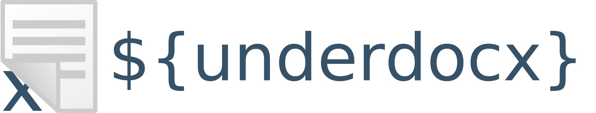
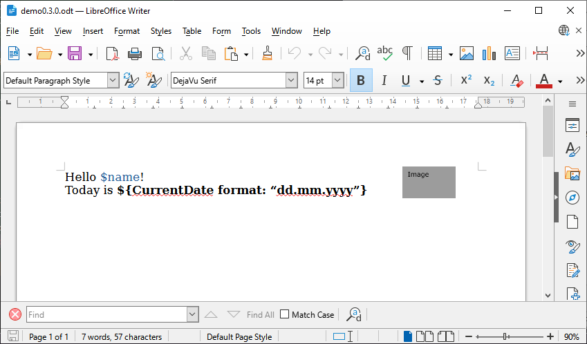
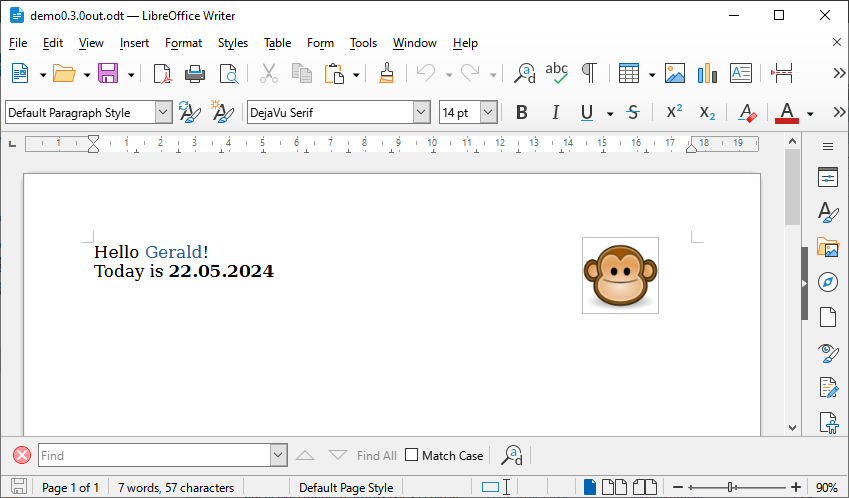
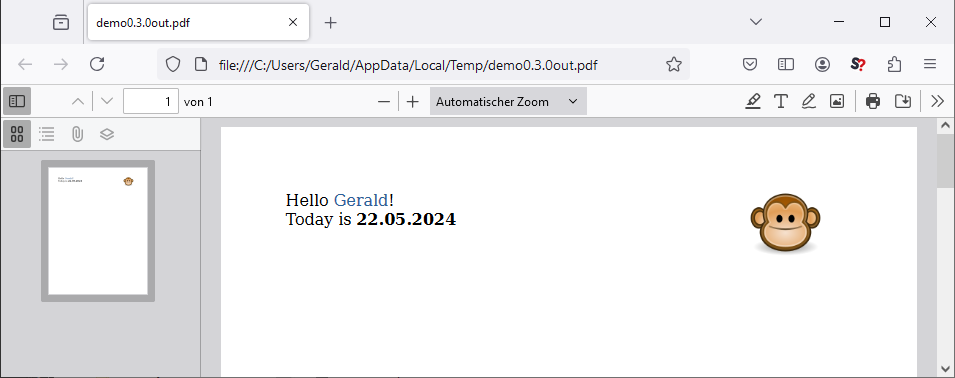

Underdocx is an extendable open source framework to manipulate ODT Documents
(LibreOffice / OpenOffice). It uses different types of placeholders that can be
found and replaced by custom texts, images, tables and other documents.
Also documents can be converted to PDF if LibreOffice has been installed.

Underdocx is still under development. See the
[Release-Plan](https://github.com/winterrifier/underdocx/wiki/Release-Plan)
which features are already available and will be released in the future.

## Demo

Here is a example to load and manipulate a LibreOffice document with two placeholders:



Run this code to exchange the placeholders

```java
OdtContainer doc = new OdtContainer(is);
DefaultODTEngine engine = new DefaultODTEngine(doc);
engine.registerSimpleDollarReplacement("name",System.getProperty("user.name"));
engine.registerSimpleDollarImageReplacement("image", imageURL, true);
engine.run();
doc.save(os);
```
And you get a filled document like this one:



When LibreOffice is installed and LIBREOFFICE environment variable is set correctly you 
can also generate a PDF:

```java
doc.writePDF(pos);
```

